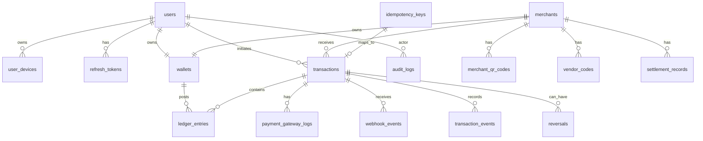

# Database Schema

Amounts are stored in paise as signed 64-bit integers. Currency defaults to `INR`.

## ER Diagram

## Tables

### users

- `id uuid primary key`
- `mobile_number varchar(15) unique not null`
- `mobile_verified_at timestamptz`
- `display_name varchar(120)`
- `email varchar(255) unique`
- `status enum(active, blocked, deleted) not null`
- `created_at timestamptz not null`
- `updated_at timestamptz not null`

Indexes:

- unique `mobile_number`
- unique partial `email where email is not null`

### user_devices

- `id uuid primary key`
- `user_id uuid references users(id)`
- `device_id varchar(128) not null`
- `device_name varchar(120)`
- `platform enum(android, ios, web, unknown)`
- `app_version varchar(32)`
- `last_seen_at timestamptz`
- `revoked_at timestamptz`
- `created_at timestamptz not null`

Unique:

- `(user_id, device_id)`

### refresh_tokens

- `id uuid primary key`
- `user_id uuid references users(id)`
- `device_id uuid references user_devices(id)`
- `token_hash varchar(255) not null`
- `family_id uuid not null`
- `expires_at timestamptz not null`
- `rotated_at timestamptz`
- `revoked_at timestamptz`
- `created_at timestamptz not null`

Indexes:

- `token_hash`
- `(user_id, device_id)`

### otp_challenges

OTP challenges can be Redis-first for MVP. Persisting metadata helps audit and fraud analytics.

- `id uuid primary key`
- `mobile_number varchar(15) not null`
- `purpose enum(login, mobile_verify) not null`
- `status enum(requested, verified, expired, failed) not null`
- `attempt_count int not null default 0`
- `expires_at timestamptz not null`
- `created_at timestamptz not null`
- `verified_at timestamptz`

Indexes:

- `(mobile_number, created_at desc)`

### wallets

- `id uuid primary key`
- `owner_type enum(user, merchant, system) not null`
- `user_id uuid references users(id)`
- `merchant_id uuid references merchants(id)`
- `system_account_code varchar(64)`
- `currency char(3) not null default 'INR'`
- `available_balance bigint not null default 0`
- `ledger_balance bigint not null default 0`
- `status enum(active, frozen, closed) not null`
- `version int not null default 0`
- `created_at timestamptz not null`
- `updated_at timestamptz not null`

Constraints:

- exactly one owner reference must be present.
- balances cannot be negative for user and merchant wallets.

Indexes:

- `(owner_type, user_id)`
- `(owner_type, merchant_id)`
- `(system_account_code)`

### merchants

- `id uuid primary key`
- `merchant_code varchar(32) unique not null`
- `business_name varchar(160) not null`
- `display_name varchar(120) not null`
- `mobile_number varchar(15)`
- `email varchar(255)`
- `status enum(pending, active, suspended, closed) not null`
- `risk_level enum(low, medium, high) not null default 'low'`
- `created_at timestamptz not null`
- `updated_at timestamptz not null`

### merchant_qr_codes

- `id uuid primary key`
- `merchant_id uuid references merchants(id)`
- `qr_payload text not null`
- `status enum(active, revoked) not null`
- `created_at timestamptz not null`
- `revoked_at timestamptz`

Indexes:

- `(merchant_id, status)`

### vendor_codes

- `id uuid primary key`
- `merchant_id uuid references merchants(id)`
- `code varchar(32) unique not null`
- `status enum(active, revoked) not null`
- `created_at timestamptz not null`
- `revoked_at timestamptz`

### transactions

- `id uuid primary key`
- `transaction_ref varchar(40) unique not null`
- `type enum(add_money, wallet_payment, reversal) not null`
- `status enum(initiated, pending, processing, succeeded, failed, reversed, expired) not null`
- `amount bigint not null`
- `currency char(3) not null default 'INR'`
- `initiated_by_user_id uuid references users(id)`
- `merchant_id uuid references merchants(id)`
- `source_wallet_id uuid references wallets(id)`
- `destination_wallet_id uuid references wallets(id)`
- `idempotency_key_id uuid references idempotency_keys(id)`
- `failure_code varchar(80)`
- `failure_message text`
- `metadata jsonb not null default '{}'`
- `created_at timestamptz not null`
- `updated_at timestamptz not null`
- `completed_at timestamptz`

Indexes:

- `(initiated_by_user_id, created_at desc)`
- `(merchant_id, created_at desc)`
- `(status, created_at)`
- `(type, status, created_at)`

### ledger_entries

- `id uuid primary key`
- `transaction_id uuid references transactions(id)`
- `wallet_id uuid references wallets(id)`
- `entry_type enum(debit, credit) not null`
- `amount bigint not null`
- `currency char(3) not null default 'INR'`
- `balance_after bigint not null`
- `description text`
- `created_at timestamptz not null`

Constraints:

- `amount > 0`

Indexes:

- `(transaction_id)`
- `(wallet_id, created_at desc)`

### idempotency_keys

- `id uuid primary key`
- `actor_type enum(user, merchant, system) not null`
- `actor_id uuid not null`
- `scope varchar(120) not null`
- `key varchar(120) not null`
- `request_hash varchar(128) not null`
- `status enum(in_progress, completed, failed) not null`
- `response_code int`
- `response_body jsonb`
- `locked_until timestamptz`
- `created_at timestamptz not null`
- `updated_at timestamptz not null`

Unique:

- `(actor_type, actor_id, scope, key)`

### payment_gateway_logs

- `id uuid primary key`
- `transaction_id uuid references transactions(id)`
- `provider varchar(40) not null`
- `provider_order_id varchar(120)`
- `provider_payment_id varchar(120)`
- `flow enum(upi_intent, upi_collect, webhook, status_check) not null`
- `direction enum(request, response) not null`
- `status varchar(80)`
- `payload jsonb not null`
- `created_at timestamptz not null`

Indexes:

- `(provider, provider_payment_id)`
- `(transaction_id, created_at)`

### webhook_events

- `id uuid primary key`
- `provider varchar(40) not null`
- `event_id varchar(160) not null`
- `event_type varchar(120) not null`
- `signature_valid boolean not null`
- `transaction_id uuid references transactions(id)`
- `payload jsonb not null`
- `received_at timestamptz not null`
- `processed_at timestamptz`
- `status enum(received, processed, duplicate, failed) not null`

Unique:

- `(provider, event_id)`

### transaction_events

- `id uuid primary key`
- `transaction_id uuid references transactions(id)`
- `event_type varchar(120) not null`
- `from_status varchar(40)`
- `to_status varchar(40)`
- `metadata jsonb not null default '{}'`
- `created_at timestamptz not null`

### reversals

- `id uuid primary key`
- `original_transaction_id uuid references transactions(id)`
- `reversal_transaction_id uuid references transactions(id)`
- `reason varchar(120) not null`
- `created_by_user_id uuid references users(id)`
- `created_at timestamptz not null`

### settlement_records

- `id uuid primary key`
- `merchant_id uuid references merchants(id)`
- `amount bigint not null`
- `currency char(3) not null default 'INR'`
- `status enum(pending, processing, settled, failed) not null`
- `metadata jsonb not null default '{}'`
- `created_at timestamptz not null`
- `updated_at timestamptz not null`

### audit_logs

- `id uuid primary key`
- `actor_type enum(user, merchant, system, admin) not null`
- `actor_id uuid`
- `action varchar(120) not null`
- `entity_type varchar(80)`
- `entity_id uuid`
- `ip_address inet`
- `user_agent text`
- `correlation_id varchar(80)`
- `metadata jsonb not null default '{}'`
- `created_at timestamptz not null`

Indexes:

- `(actor_type, actor_id, created_at desc)`
- `(entity_type, entity_id, created_at desc)`
